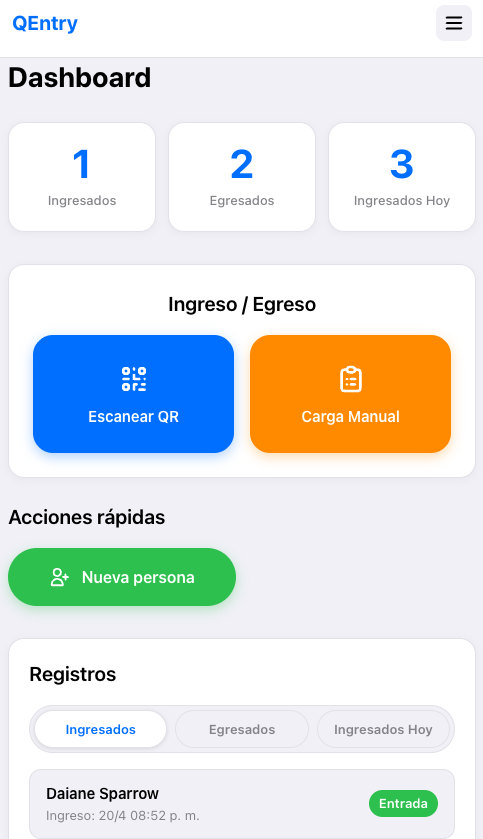
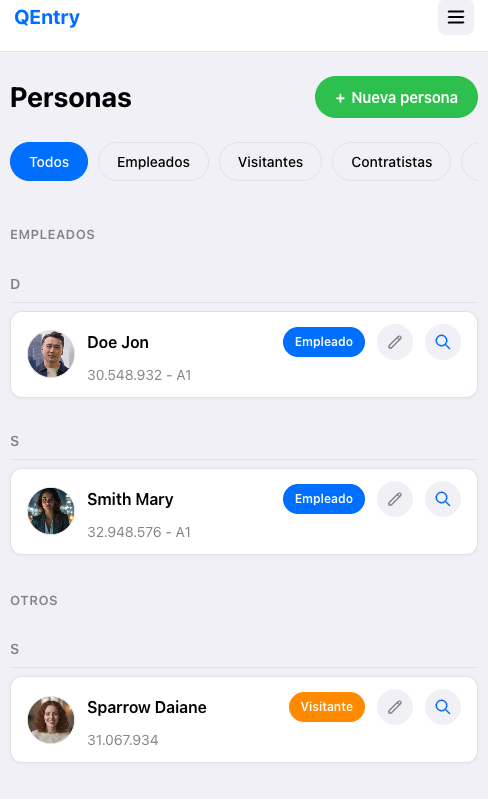
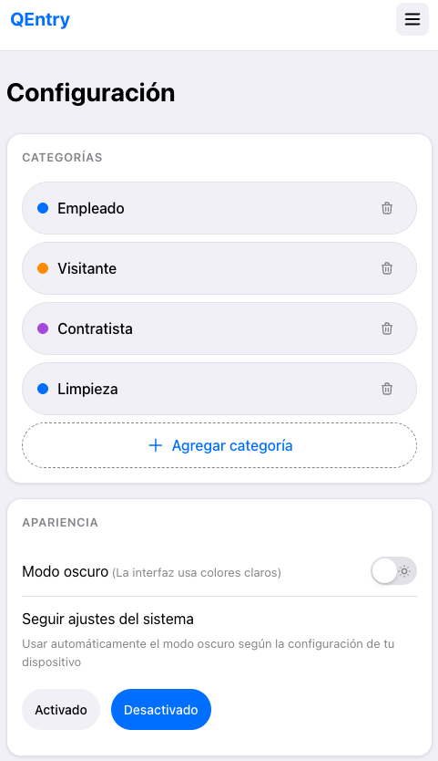
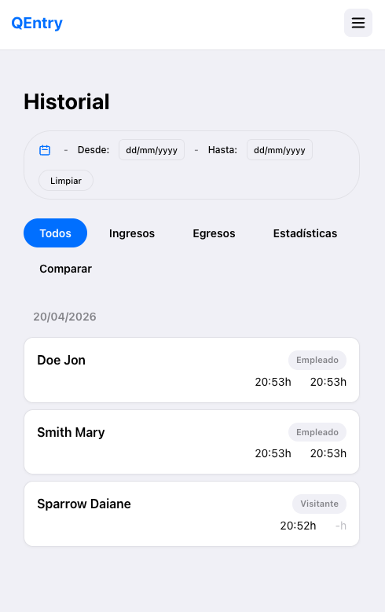
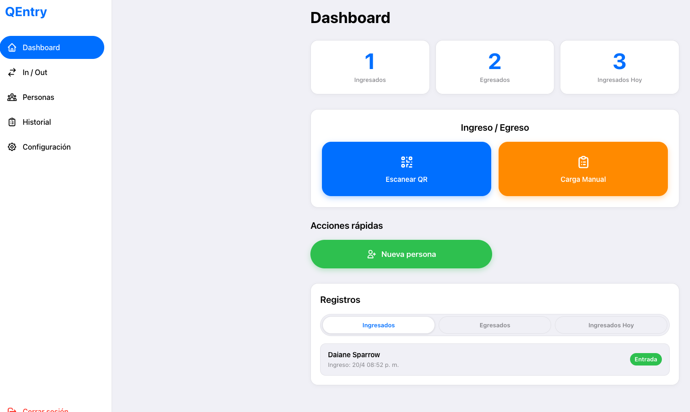
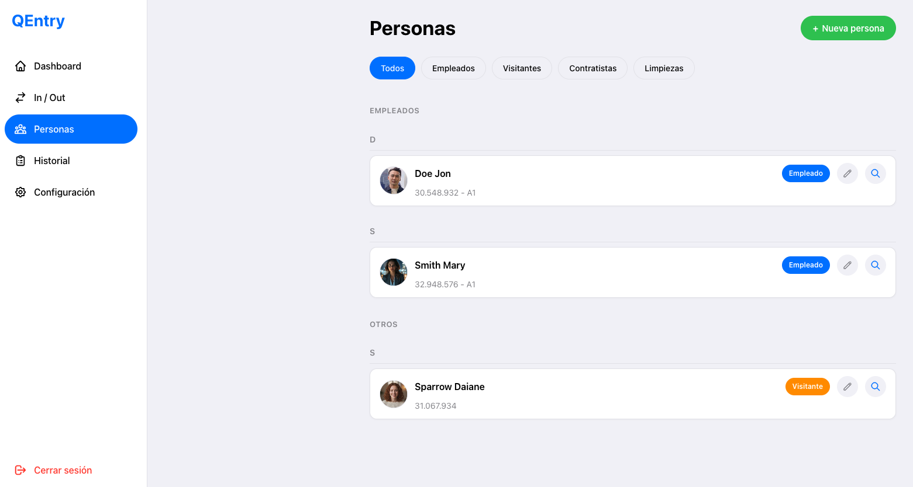
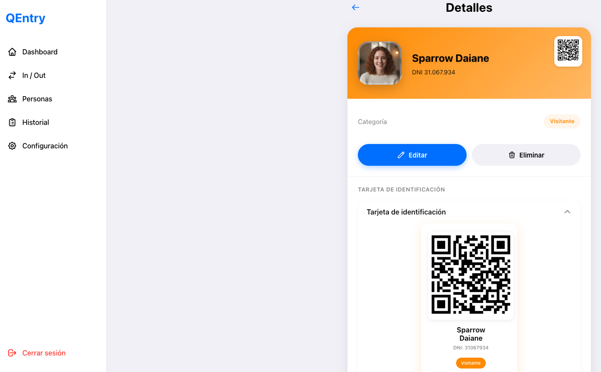
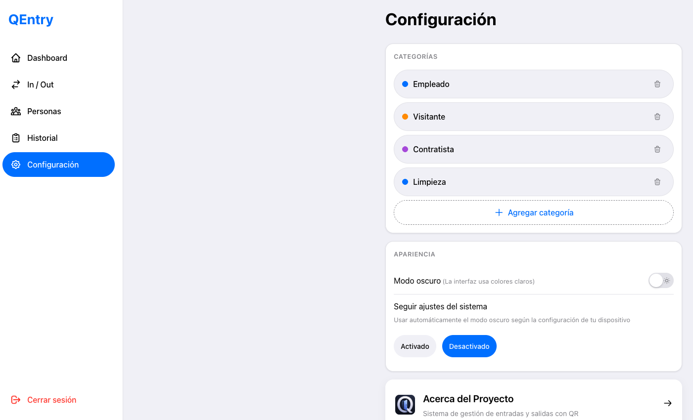
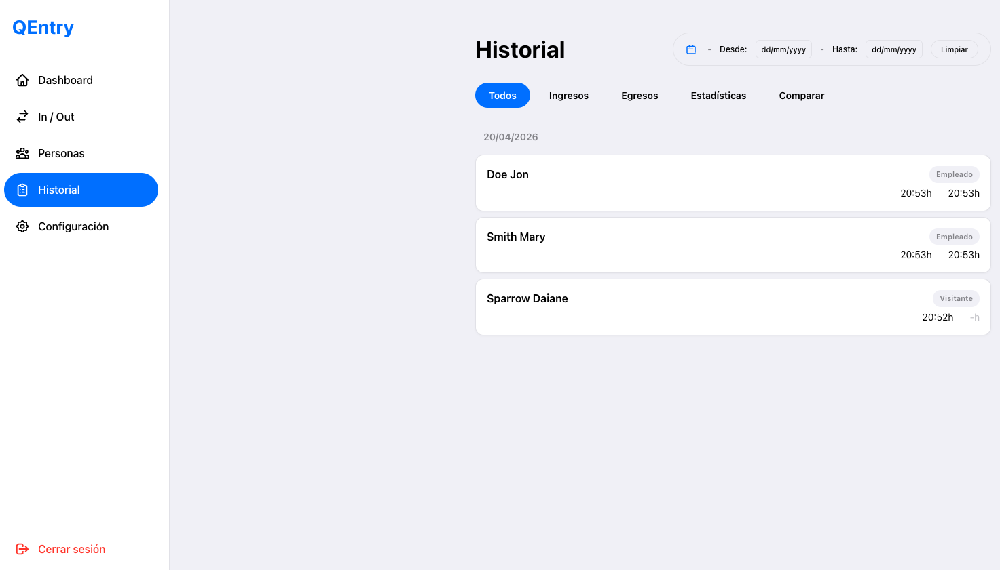

# QENTRY


_**QEntry is a desktop access control application that allows organizations to efficiently manage the entry and exit of people in real time using QR codes.**_

The app enhances security and organization by enabling user registration, QR code generation, access logging, and monitoring of movements within a facility. It also supports features like role-based access, entry validations, and activity tracking, helping administrators maintain control, ensure safety, and streamline operations.

[](https://github.com/ismaelmarot/QEntry/releases)
&nbsp;&nbsp;&nbsp;&nbsp;
[](https://github.com/ismaelmarot/QEntry/blob/main/LICENSE)
&nbsp;&nbsp;&nbsp;&nbsp;
[
&nbsp;&nbsp;&nbsp;&nbsp;

### Frontend Stack


### Backend Stack


### Desktop


---

## What It Does?

- **Person Management**: Register and manage people with photos and details
- **QR Code Generation**: Generate unique QR codes for each person
- **QR Code Scanning**: Scan QR codes to register entry and exit events
- **Entry/Exit Logging**: Track all entries and exits with timestamps
- **Real-time Dashboard**: Monitor current occupancy and activity in real-time
- **Role-based Access**: Different access levels for administrators and operators
- **Activity History**: Complete log of all access events with search and filters
- **Dark/Light Mode**: Full support for system theme preferences

---

## 🛠️ INFRASTRUCTURE & SERVICES

| Service | Badge | Description |
|---|---|---|
| **Desktop App** |  | Cross-platform desktop application (macOS & Windows) |
| **Database** |  | Local SQLite database for data persistence |
| **Backend** |  | Express.js backend API embedded in Electron |

---

## 📑 TABLE OF CONTENT

1. [Highlights](#highlights)
2. [Core Features](#core-features)
3. [Technologies Stack](#technologies-stack)
4. [Installation](#installation)
5. [Usage](#usage)
6. [Project Structure](#project-structure)
7. [API Endpoints](#api-endpoints)
8. [Database Schema](#database-schema)
9. [Desktop App](#desktop-app)
10. [Screenshots](#screenshots)
11. [License](#license)
12. [Contact](#contact)

---

<a id="highlights"></a>
## 🌟 HIGHLIGHTS

- Cross-platform desktop application with Electron
- Local SQLite database (no external dependencies)
- Real-time entry/exit tracking with QR codes
- Beautiful Apple/iOS-inspired design
- Dark/Light mode support
- JWT-based authentication
- Camera integration for QR code scanning
- Photo capture for person registration
- Embedded backend (no separate server needed)

---

<a id="core-feature"></a>
## ✨ CORE FEATURES

| Feature | Description |
|---|---|
| Person Management | Add, edit, and delete people with photos and details |
| QR Code Generation | Generate unique QR codes for each registered person |
| QR Code Scanning | Built-in camera integration to scan QR codes |
| Entry Logging | Record entry events with timestamp and person info |
| Exit Logging | Record exit events when people leave |
| Dashboard | Real-time view of current occupancy and recent activity |
| Activity History | Searchable log of all access events |
| User Authentication | Secure login with role-based access (Admin/Operator) |
| Theme Support | System-aware dark/light mode |

---

<a id="echnologies-stack"></a>
## 🛠️ TECHNOLOGIES STACK

| Category | Library / Tool | Version |
|---|---|---|
| Desktop Framework | Electron | ^33.0.0 |
| Frontend UI | React | ^18.2.0 |
| Frontend Language | TypeScript | ~5.3.0 |
| Frontend Build | Vite | ^5.0.0 |
| Frontend Styling | styled-components | ^6.0.0 |
| Frontend Icons | react-icons | ^5.0.0 |
| Backend Framework | Express | ^4.18.0 |
| Backend Language | Node.js | ^22.0.0 |
| Database | better-sqlite3 | Latest |
| Authentication | JWT | ^9.0.0 |
| QR Code Generation | qrcode | ^1.5.0 |
| QR Code Scanning | html5-qrcode | ^2.3.0 |
| Desktop Builder | electron-builder | Latest |

---

<a id="installation"></a>
## 🚀 INSTALLATION

### Prerequisites

- Node.js >= 18
- npm or yarn

### 1. Clone the repository

```bash
git clone https://github.com/ismaelmarot/QEntry.git
cd QEntry
```

### 2. Install dependencies

```bash
npm install
```

### 3. Run development mode

```bash
npm run electron-dev
```

### 4. Build desktop application

```bash
# Build for current platform
npm run package

# Build for both platforms
npm run package:all
```

---

<a id="usage"></a>
## ⚙️ USAGE

### Getting Started

1. **Launch the application** from the built installer or by running in development mode
2. **Log in** with the default admin credentials (or create a new user)
3. **Add people** by clicking "Add Person" and filling in their details
4. **Generate QR codes** for each person from the Persons management screen
5. **Scan QR codes** using the Entry/Exit buttons to register movements

### User Roles

- **Administrator**: Full access to all features including user management
- **Operator**: Can scan QR codes and view activity but cannot manage users

### Default Credentials

The first time you run the app, you can register an admin account.

---

<a id="project-structure"></a>
## 📂 PROJECT STRUCTURE

```
QENTRY
├── frontend/                    # React + Vite frontend
│   ├── src/
│   │   ├── App.tsx            # Root component
│   │   ├── pages/             # Page components
│   │   │   ├── Login/
│   │   │   ├── Dashboard/
│   │   │   ├── Persons/
│   │   │   ├── EntryExit/
│   │   │   └── History/
│   │   ├── components/        # Reusable UI components
│   │   ├── hooks/             # Custom React hooks
│   │   ├── context/           # React context providers
│   │   ├── services/          # API service functions
│   │   ├── styles/            # Global styles and themes
│   │   └── utils/             # Utility functions
│   └── public/
│
├── backend/                     # Express + SQLite backend
│   ├── routes/                 # API routes
│   │   ├── auth.routes.js
│   │   ├── persons.routes.js
│   │   └── events.routes.js
│   ├── db/
│   │   ├── database.js        # SQLite connection
│   │   └── schema.js          # Database schema
│   └── index.js               # Express app entry
│
├── electron.js                 # Electron main process
├── preload.js                  # Electron preload script
├── electron-builder.json       # Electron Builder configuration
│
├── README.md
├── LICENSE
└── package.json
```

---

<a id="api-endpoints"></a>
## 🔌 API ENDPOINTS

### Authentication

| Method | Endpoint | Description |
|---|---|---|
| POST | /api/auth/register | Register new user |
| POST | /api/auth/login | User login |
| GET | /api/auth/me | Current user info |

### Persons

| Method | Endpoint | Description |
|---|---|---|
| GET | /api/persons | List all persons |
| POST | /api/persons | Create new person |
| GET | /api/persons/:id | Get person by ID |
| PUT | /api/persons/:id | Update person |
| DELETE | /api/persons/:id | Delete person |
| GET | /api/persons/:id/qrcode | Generate QR code for person |

### Events

| Method | Endpoint | Description |
|---|---|---|
| GET | /api/events | List all events (with filters) |
| POST | /api/events/entry | Register entry event |
| POST | /api/events/exit | Register exit event |
| GET | /api/events/stats | Get current occupancy stats |

---

<a id="edatabase-schema"></a>
## 💾 DATABASE SCHEMA

### User

```json
{
  "id": "INTEGER PRIMARY KEY",
  "username": "TEXT UNIQUE",
  "password_hash": "TEXT",
  "role": "TEXT (admin | operator)",
  "created_at": "DATETIME"
}
```

### Person

```json
{
  "id": "INTEGER PRIMARY KEY",
  "name": "TEXT",
  "lastname": "TEXT",
  "dni": "TEXT UNIQUE",
  "email": "TEXT",
  "phone": "TEXT",
  "photo": "TEXT",
  "qr_code": "TEXT",
  "active": "INTEGER (0 | 1)",
  "created_at": "DATETIME",
  "updated_at": "DATETIME"
}
```

### Event

```json
{
  "id": "INTEGER PRIMARY KEY",
  "person_id": "INTEGER",
  "type": "TEXT (entry | exit)",
  "timestamp": "DATETIME",
  "notes": "TEXT"
}
```

---

<a id="desktop-app"></a>
## 🖥️ DESKTOP APP

### Downloads

| Platform | File | Status |
|---|---|---|
| macOS | QEntry-1.0.0-arm64.dmg | Download from Releases |
| Windows | QEntry Setup 1.0.0.exe | Download from Releases |

### Building from Source

```bash
# Install dependencies
npm install

# Build for macOS
npm run package:mac

# Build for Windows
npm run package:win

# Build for current platform
npm run package
```

The built installers will be located in the `dist_electron/` directory.

------------------------------------------------------------------------------------

<a id="screenshots"></a>
## 📸 [Screenshots](#-table-of-content)

>### 📱 Mobile

<p align="center">
  
  
  
  
</p>
<details>
<summary><strong>See more...</strong></summary>
<br>
  
>### 🖥️ Desktop
>
<p align="center">
  
  
</p>
<p align="center">
  
  
</p>
<p align="center">
  
</p>
</details>

<br>

&nbsp;&nbsp;&nbsp;&nbsp;

------------------------------------------------------------------------------------

<a id="license"></a>
## 📄 LICENSE

This project is licensed under the MIT License - see the [LICENSE](LICENSE) file for details.

---

<a id="contact"></a>
## 📬 CONTACT

Open to collaboration, feedback, and new opportunities.

[](https://github.com/ismaelmarot)
[](https://linkedin.com/in/ismael-marot)
[](https://ismaelmarot.github.io)
